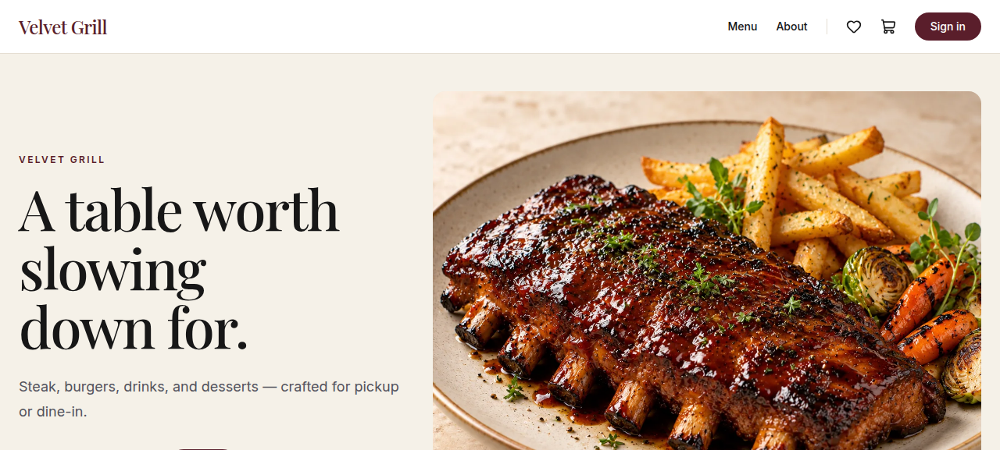
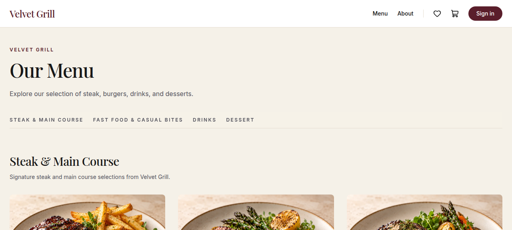
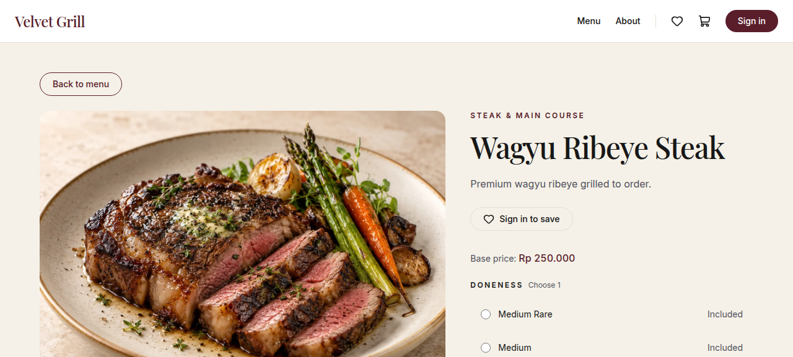

# Velvet Grill

A security-conscious restaurant e-commerce portfolio project: a single-brand
steakhouse storefront with catalog, product options, wishlist, cart, checkout,
pickup and dine-in fulfillment, dummy payments, order history, reviews,
notifications, and a full admin backend.

> **Portfolio project — not a commercial restaurant platform.** All payments
> are simulated ("demo payment" buttons), the brand is fictional, and the
> data is deterministic local seed data. See `PRD.md` §1 and §8 for scope.

## Stack

- Next.js 16 (App Router) + TypeScript + Tailwind CSS
- Supabase (Auth, PostgreSQL + RLS, Storage)
- Zod for input validation
- pgTAP for database/RLS tests
- Git + GitHub · AI-assisted development via Command Code

## Documentation map

| Document | Purpose |
| --- | --- |
| `PRD.md` | Product requirements (FR-01…FR-33), NFRs, scope |
| `ARCHITECTURE.md` | System boundaries, order/payment state machines, RLS rules |
| `DESIGN_SYSTEM.md` | Brand tokens, typography, interaction rules |
| `SECURITY_WORKFLOW.md` | Threat model, server authority, destructive-op approval |
| `AI_WORKFLOW.md` | Plan → Implement → Test → Review → Verify → Commit workflow |
| `SKILLS_PLAN.md` | Agent skill strategy |
| `RELEASE_CHECKLIST.md` | Final smoke-test / acceptance checklist |
| `AGENTS.md` | Operating rules for coding agents |

## Quickstart

Prerequisites: **Node.js 22+**, **Docker** (for the local Supabase stack),
npm.

```bash
# 1. Install dependencies
npm install

# 2. Start the local Supabase stack (first run pulls images)
npx supabase start

# 3. Apply migrations + seed data.
#    ⚠️  This DESTROYS AND RECREATES the local database. It is a
#    destructive operation gated by SECURITY_WORKFLOW.md §10 —
#    in this repository it is run by (or with the approval of) a human.
npx supabase db reset --local

# 4. Configure environment
cp .env.example .env.local
#    then fill in NEXT_PUBLIC_SUPABASE_URL and
#    NEXT_PUBLIC_SUPABASE_PUBLISHABLE_KEY from `npx supabase status`

# 5. Run the app
npm run dev
# → http://localhost:3000
```

Supabase Studio: `http://127.0.0.1:54323` · Mailpit (local email inbox):
`http://127.0.0.1:54324`.

## Demo accounts (local/demo-only)

| Role | Email | Password |
| --- | --- | --- |
| Customer | `demo@velvetgrill.test` | `velvet-demo-2026` |
| Admin | `admin@velvetgrill.test` | `velvet-admin-2026` |

These accounts are **provisioned only by `supabase/seed.sql`** and are for
local development and portfolio review only. **Security requirement:** the
demo seed must not be executed in production or shared environments, and
these demo credentials must never be reused for real or administrative
accounts. Admin authorization is still enforced server-side and by RLS
(`FR-30`).

## Environment variables

| Variable | Required | Purpose |
| --- | --- | --- |
| `NEXT_PUBLIC_SUPABASE_URL` | yes | Supabase project URL (local: `http://127.0.0.1:54321`) |
| `NEXT_PUBLIC_SUPABASE_PUBLISHABLE_KEY` | yes | Publishable (anon) key — the app intentionally uses only the publishable key + RLS |
| `NEXT_PUBLIC_SITE_URL` | no | Canonical/OG base URL for `metadataBase`, robots, sitemap. Unset = `http://localhost:3000`. Set it only when a production deployment is approved; never point it at the Supabase API URL. |

Secrets stay server-side and out of source control: `.env*` is gitignored
(`.env.example` is the tracked exception).

## Testing

Prerequisites: Docker running, stack started (`npx supabase start`),
migrations applied.

```bash
npm run lint        # ESLint
npm run typecheck   # tsc --noEmit
npm run build       # production build
npm run test:db     # full pgTAP suite via supabase test db

# Two-session race proofs (not collected by `supabase test db`):
bash supabase/scripts/stock_oversell_check.sh      # FR-21 overselling
bash supabase/scripts/fr31_expiry_race_check.sh   # FR-31 expiry vs confirm
```

The pgTAP suites under `supabase/tests/` cover catalog, auth/profiles, cart,
wishlist, orders, pricing, snapshots, coupons, payments, reviews,
notifications, analytics, and admin authorization.

## Screenshots

Captured from the running local application (`npm run dev`) using the
existing seeded catalog data. These captures do not exercise the demo
accounts or verify sign-in — see `RELEASE_CHECKLIST.md` for that flow.
More in `docs/screenshots/`.







## Deployment

No production deployment is configured — the project is local-first by
design. When a deployment is approved, set `NEXT_PUBLIC_SITE_URL` so
canonical/OG URLs resolve correctly, and provision real accounts through
proper operator account management. Do not execute the demo seed against
production or shared environments.
